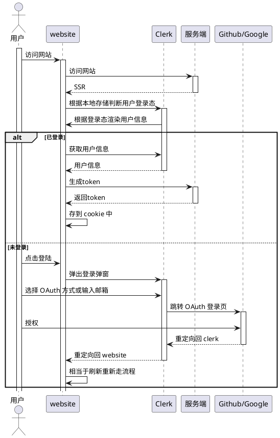
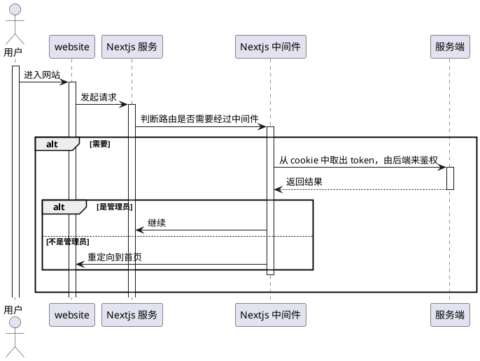

# OAuth 登录流程

```plantuml
@startuml

actor "用户" as user
participant "website" as website
participant "Clerk" as clerk
participant "服务端" as server
participant "Github/Google" as th

user ++

user -> website ++: 访问网站
website -> server ++: 访问网站
return SSR
website -> clerk: 根据本地存储判断用户登录态
clerk ++
clerk -> website: 根据登录态渲染用户信息

alt 已登录

	website -> clerk: 获取用户信息
  return 用户信息
	website -> server ++: 生成token
	return 返回token
	website -> website: 存到 cookie 中
	clerk --
  |||

else 未登录

	user -> website: 点击登陆
	website -> clerk ++: 弹出登录弹窗
	user -> clerk: 选择 OAuth 方式或输入邮箱
	clerk -> th ++: 跳转 OAuth 登录页
	user -> th: 授权
	return 重定向回 clerk
	return 重定向回 website
	website -> website: 相当于刷新重新走流程

end

@enduml
```

# 后台鉴权

```plantuml
@startuml

actor "用户" as user
participant "website" as website
participant "Nextjs 服务" as next
participant "Nextjs 中间件" as mid
participant "服务端" as server

user++
user -> website ++: 进入网站
website -> next ++: 发起请求
next -> mid ++: 判断路由是否需要经过中间件

alt 需要

  mid -> server ++: 从 cookie 中取出 token，由后端来鉴权
  return 返回结果

  alt 是管理员

    mid -> next: 继续

  else 不是管理员

    mid -> website: 重定向到首页

  end

  mid --

  |||

end

@enduml
```
